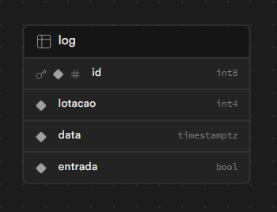
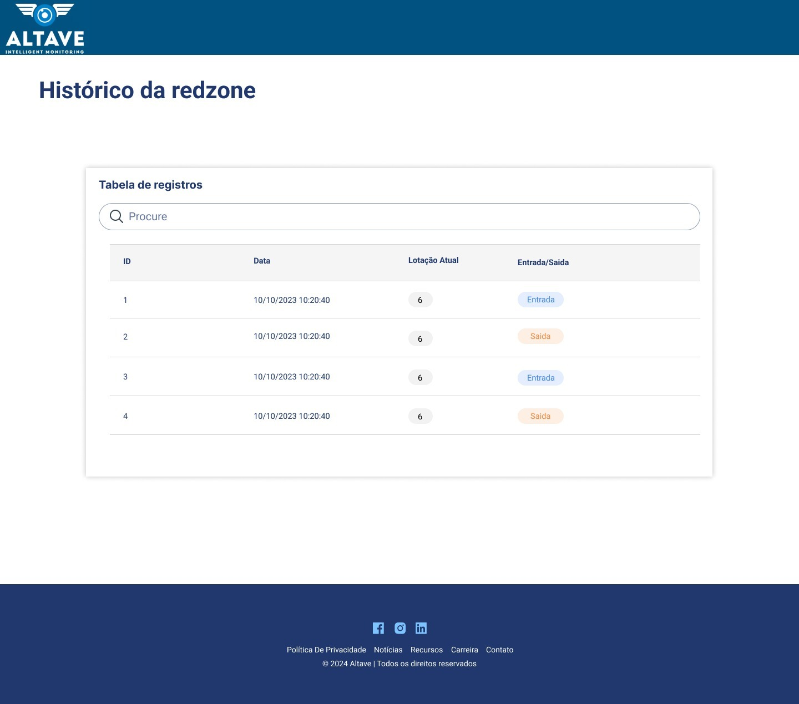

# 📃 DoR(Definition of Ready):

## 🗒️ Backlog Sprint 1 
| Rank | Prioridade | User Story | Estimativa |Sprint | Requisito do Parceiro |
|--- |--- |--- |--- |--- | --- |
| 1 | Alta | Como gerente, quero que use uma inteligência artificial que utilize a câmera na entrada da redzone para fazer a contagem de pessoas que saíram e entraram dela, para não precisar fazer uma contagem manual. | 80 | 1 | RF8 |
| 2 | Alta | Como gerente, desejo ter a capacidade de visualizar os registros de acesso à redzone, a fim de identificar precisamente os horários de entrada e saída dos usuários, possibilitando um monitoramento eficaz das atividades. | 60 | 1 |RF6 |
| 3 | Alta |Como gerente, desejo visualizar em tempo real a quantidade de pessoas na redzone, para poder monitorar efetivamente a presença de indivíduos nessa área específica. | 15 | 1 | RF8 |
| 4 | Alta |Como gerente, desejo uma interface de busca que utilize a data como filtro e apresente os resultados em uma tabela, incluindo os horários de entrada e saída na redzone, para facilitar futuras análises de dados. | 10 | 1 | RF6 |

RF6 - Desenvolver um CRUD (Criar, Ler, Alterar e Deletar) de Redzone.

RF8 - Utilizar a câmera da entrada para contabilizar as pessoas que entraram e saíram da Redzone.

### Critérios de aceitação

Rank 1 :
- A inteligência artificial deve ser capaz de contar as pessoas que entram e saem com base nas imagens da câmera da entrada da redzone.

- Os registros de entrada e saída de pessoas devem ser salvos no banco de dados.

Rank 2 : 
- A visualização dos registros deve ser clara e organizada, expondo as seguintes informações; data e horária das entradas e saídas da redzone.

Rank 3 : 
 - A visualização em tempo real deve ser precisa e atualizada continuamente conforme as pessoas entram e saem da redzone.

Rank 4 : 
 - A interface de busca deve permitir ao gerente filtrar os registros de acesso à redzone por data específica.
 - Os resultados da busca devem ser apresentados de forma clara e organizada em uma tabela, incluindo informações como horários de entrada e saída.

## 📝 Modelo do Banco de Dados
O modelo de banco de dados utilizado e desenvolvido nessa sprint foi:

## 🎨 Mockups

## 💾 Dados
O dataset utilizado para o treinamento da IA é o YOLO-V8. Para acessar a documentação completa deste dataset, você pode visitar o repositório oficial no GitHub: [Documentação](https://github.com/autogyro/yolo-V8)

## Vídeo da Sprint 1

***Por favor, para o carregamento das gifs espere alguns segundos.***
- Monitoramento do fluxo de pessoas em tempo real - IA

- Visualização do fluxo de pessoas em tempo real - Frontend

- 📂 Pasta completa dos materiais desenvolvidos na sprint 1 - [Link](https://drive.google.com/drive/folders/1Z6rl5nGkvD1bf-cNF6al9NBHzDnzO9gJ)

