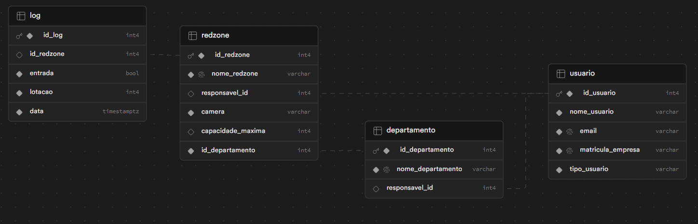

# 📃 DoR(Definition of Ready):

## 🗒️ Backlog Sprint 2 
| Rank | Prioridade | User Story | Estimativa |Sprint | Requisito do Parceiro |
|--- |--- |--- |--- |--- |--- |
| 5 | Média | Como gerente geral, quero poder criar um departamento no sistema, fornecendo informações como nome, responsável e redzones atreladas a esse departamento, para cadastrar as novas redzones. | 15 | 2 |RF7 |
| 6 | Média | Como gerente geral, quero uma página inicial que me permita acessar facilmente todas os departamentos monitorados, incluindo métricas importantes como capacidade atual e alertas ativos, para facilitar o gerenciamento. | 15 | 2 | RF7 |
| 7 | Média | Como gerente geral, quero poder criar uma nova redzone no sistema ela tem que estar atrelada ao departamento que sou responsável, fornecendo informações como nome, responsável, câmera e capacidade máxima, para cadastrar as novas redzones.| 15 | 2 | RF6 |
| 8 | Média | Como gerente geral, quero uma página inicial que me permita acessar facilmente todas as informações como métricas importantes como capacidade atual, alertas ativos e responsável pela redzone, para facilitar o gerenciamento. | 15 | 2 | RF6 |
| 9 | Média | Como gerente, desejo uma ferramenta que permita filtrar (por período desejado) os dados de acesso para comparação, para analisar tendências e identificar variações significativas. | 15 | 2 | RF3 |
| 10 | Média | Como gerente, desejo uma função de exportação de dados que me permita baixar relatórios detalhados contendo todas as datas e horários de entrada e saída na redzone durante o período escolhido, para análise externa.| 15 | 2 | RF4 |
| 11 | Média | Como gerente geral, quero poder alterar os dados de um determinado departamento no sistema, para poder cadastrar e corrigir dados já existentes. | 10 | 2 | RF7 |
| 12 | Média | Como gerente geral, quero poder alterar os dados de uma determinada redzone no sistema, para poder cadastrar e corrigir dados já existentes. | 10 | 2 | RF6 |
| 13 | Média | Como gerente geral, quero poder cadastrar um novo usuário no sistema, fornecendo seu nome, e-mail, matrícula da empresa e tipo de usuário, (guarda, gerente de área), para garantir que a equipe de segurança esteja completa e atualizada. | 10 | 2 | RF5 |
| 14 | Média | Como gerente geral, desejo uma funcionalidade que me permita visualizar todos os usuários do sistema, sendo os gerentes de área e guardas, para ter uma visão geral da equipe de segurança. | 10 | 2 | RF5 |
| 15 | Média | Como gerente geral, quero poder alterar do usuário, para lidar com mudanças dos dados da equipe. | 10 | 2 | RF5 |
| 16 | Média | Como gerente geral, quero poder desativar um determinado departamento, para garantir a segurança e integridade das áreas monitoradas. | 5 | 2 | RF7|
| 17 | Média | Como gerente geral, quero poder desativar uma determinada redzone, para garantir a segurança e integridade das áreas monitoradas. | 5 | 2 | RF6 |
| 18 | Média | Como gerente geral, quero poder desativar um usuário, para impedir o acesso quando necessário. | 5 | 2 | RF5 |

RF3 - Filtros de período para análise dos dados.

RF4 - Geração de relatórios para compartilhamento.

RF5 - Desenvolver um CRUD (Criar, Ler, Alterar e Deletar) de Usuários.

RF6 - Desenvolver um CRUD (Criar, Ler, Alterar e Deletar) de Redzone.

RF7 - Desenvolver um CRUD (Criar, Ler, Alterar e Deletar) de Departamento.

## 📋  User Stories, Critérios de Aceitação e Use Case

#### US #5: Como gerente geral, quero poder criar um departamento no sistema, fornecendo informações como nome, responsável e redzones atreladas a esse departamento, para cadastrar as novas redzones. 

#### Critérios de aceitação:

- Ao criar um departamento, é essencial que o usuário tenha campos disponíveis para preencher, tais como o nome do departamento e o nome do responsável é o sistema deve ser capaz de armazenar esses dados.

#### Use Case: 

Pré-condições:
- Já possuir um Gerente de área cadastrado.

Fluxo Principal: 
- O Gerente Geral preenche os campos obrigatórios, incluindo nome e responsável pelo departamento.
- O sistema salva o novo departamento.

Fluxo Alternativo:
- Se possuir uma departamento com o mesmo nome:
- O sistema exibe uma mensagem dizendo que ‘’Esse nome já está sendo utilizado.’’

#### US #6: Como gerente geral, quero uma página inicial que me permita acessar facilmente todas os departamentos monitorados, incluindo métricas importantes como capacidade atual e alertas ativos, para facilitar o gerenciamento. 

#### Critérios de aceitação:

- Deve exibir todos os departamentos monitorados, incluindo as informações importantes como capacidade atual e alertas ativos.
- As informações exibidas na página inicial devem ser atualizadas automaticamente conforme ocorrem mudanças nos departamentos.

#### Use Case: 

Pré-condições:
- O sistema redireciona automaticamente para a página inicial do Departamento.

Fluxo Principal: 
- A página inicial exibe as métricas importantes, como capacidade atual, alertas ativos e responsável pela redzones.
- As informações são atualizadas automaticamente conforme as mudanças ocorrem nas redzones.

Fluxo Alternativo:
- Se não possuir dados no departamento:
- O sistema informa o usuário com uma mensagem "Não possui logs no departamento".

#### US #7: Como gerente geral, quero poder criar uma nova redzone no sistema ela tem que estar atrelada ao departamento que sou responsável, fornecendo informações como nome, responsável, câmera e capacidade máxima, para cadastrar as novas redzones.

#### Critérios de aceitação:

- Ao criar uma nova redzone, deve conter todos os campos sendo eles; nome, responsável, câmera e capacidade máxima.
- A redzone criada deve ser automaticamente atrelada ao departamento.
- Cada redzone tem que possuir sua própria câmera para poder fazer o log de fluxo.

#### Use Case: 

Pré-condições:
- A redzone tem que obrigatoriamente vinculada com um departamento.

Fluxo Principal: 
- Acessa a funcionalidade de criação de nova redzone.
- Preenche os campos obrigatórios da redzone.
- O sistema cria a nova redzone e a atrela automaticamente ao departamento do gerente geral.

Fluxo Alternativo:
- Se possuir uma redzone com o mesmo nome:
- O sistema exibe uma mensagem dizendo que ‘’Esse nome já está sendo utilizado.’’
- Se não tiver um departamento cadastrado:
- O sistema mostra uma mensagem dizendo que “Não possui Departamento cadastrado ainda.”

#### US #8:  Como gerente geral, quero uma página inicial que me permita acessar facilmente todas as informações como métricas importantes como capacidade atual, alertas ativos e responsável pela redzone, para facilitar o gerenciamento.

#### Critérios de aceitação:

- Deve exibir todos das redzone, nome, responsável, câmera e capacidade máxima.
- As informações devem ser atualizadas em tempo real para refletir a situação mais recente das redzones.

#### Use Case: 

Pré-condições:
- O sistema redireciona automaticamente para a página inicial da Redzone.

Fluxo Principal: 
- A página inicial exibe as métricas importantes, como capacidade atual, alertas ativos e responsável pela redzone.
- As informações são atualizadas automaticamente conforme as mudanças ocorrem na redzone.

Fluxo Alternativo:
- Se não possuir dados na redzone:
- O sistema informa o usuário com uma mensagem "Não possui logs na redzone".

#### US #9:  Como gerente, desejo uma ferramenta que permita filtrar (por período desejado) os dados de acesso para comparação, para analisar tendências e identificar variações significativas.

#### Critérios de aceitação:

- As informações devem ser atualizadas em tempo real para refletir a situação mais recente das redzones.
- O sistema deve permitir a seleção da redzone.
- Deve ser possível escolher o período desejado, com uma data de início e uma data de fim para a seleção.

#### Use Case: 

Pré-condições:
- O sistema deve ter redzones previamente cadastradas.

Fluxo Principal: 
- O usuário seleciona a redzone, e o período que deseja visualizar os dados.
- O sistema processa a seleção do usuário e apresenta os dados relacionados a redzone selecionada devolvendo o id, entrada/saída, lotação, data/hora.

Fluxo Alternativo:
- Se não possuir dados no período selecionado:
O sistema informa o usuário.

#### US #10:  Como gerente, desejo uma função de exportação de dados que me permita baixar relatórios detalhados contendo todas as datas e horários de entrada e saída na redzone durante o período escolhido, para análise externa.

#### Critérios de aceitação:

- O sistema deve fornecer uma função de exportação de dados claramente visível e acessível para o usuário.
- O relatório exportado deve incluir informações detalhadas sobre todas as datas e horários de entrada e saída na redzone durante o período selecionado.
- O relatório deve ser exportado em formatos comuns e compatíveis, como Excel e Csv, para facilitar a análise externa.

#### Use Case: 

Pré-condições:
- Deve haver pelo menos uma redzone cadastrada no sistema.

Fluxo Principal:
- O usuário acessa a funcionalidade de Filtragem Redzones.
- Seleciona a redzone desejada para gerar o relatório e define o período.
- Clica em "Pesquisar".
- O sistema retorna os logs da redzone selecionada e disponibiliza métodos de exportação.
- O usuário escolhe o método de exportação de sua preferência.
- O sistema realiza o download do relatório.

Fluxo Alternativo:
- Se não houver redzones cadastradas:
- O sistema exibe uma mensagem informando que não existem redzones no sistema.
- Se não houver registros de logs no período selecionado:
- O sistema mostra uma mensagem indicando que não há registros disponíveis.

#### US #11: Como gerente geral, quero poder alterar os dados de um determinado departamento no sistema, para poder cadastrar e corrigir dados já existentes. 

#### Critérios de aceitação:

- Poder modificar informações como nome, responsável do departamento existente.
- Após a alteração dos dados, as informações atualizadas devem ser refletidas imediatamente no sistema.

#### Use Case: 

Pré-condições:
- Estar na tela inicial do Departamento.

Fluxo Principal: 
- Seleciona o departamento que deseja modificar.
- O sistema exibe os campos de dados do departamento para edição.
- Realiza as alterações desejadas nos campos relevantes.
- O sistema salva as alterações e atualiza os dados do departamento.

Fluxo Alternativo:
- Se possuir um departamento com o mesmo nome:
- O sistema exibe uma mensagem dizendo que ‘’Esse nome já está sendo utilizado.’’

#### US #12: Como gerente geral, quero poder alterar os dados de uma determinada redzone no sistema, para poder cadastrar e corrigir dados já existentes. 

#### Critérios de aceitação:

- O gerente geral pode modificar informações como nome, responsável e capacidade máxima de uma redzone existente.
- Após a alteração dos dados, as informações atualizadas devem ser refletidas imediatamente no sistema.

#### Use Case: 

Pré-condições:
- Estar na tela inicial da redzone.

Fluxo Principal: 
- Seleciona a redzone que deseja modificar.
- O sistema exibe os campos de dados da redzone para edição.
- Realiza as alterações desejadas nos campos relevantes.
- O sistema salva as alterações e atualiza os dados da redzone.

Fluxo Alternativo:
- Se possuir uma redzone com o mesmo nome:
- O sistema exibe uma mensagem dizendo que ‘’Esse nome já está sendo utilizado.’’
- Se não tiver um departamento cadastrado:
- O sistema mostra uma mensagem dizendo que “Não possui Departamento cadastrado ainda.”

#### US #13:  Como gerente geral, quero poder cadastrar um novo usuário no sistema, fornecendo seu nome, e-mail, matrícula da empresa e tipo de usuário, (guarda, gerente de área), para garantir que a equipe de segurança esteja completa e atualizada.

#### Critérios de aceitação:

- O sistema deve possuir os seguintes campos nome, e-mail, matrícula da empresa, senha e tipo de usuário, (guarda, gerente de área).
- Ficar disponível no sistema para poder ser selecionado. Se for um guarda, será alocado na redzone; se for um gerente de área no departamento.

#### Use Case: 

Pré-condições:
- Estar na tela inicial dos Usuários.

Fluxo Principal: 
- Preenche os campos obrigatórios, incluindo nome, e-mail, matrícula da empresa, senha e tipo de usuário.
- O sistema cria um perfil para o novo usuário, que poderá ser anexado a um departamento ou redzone.

Fluxo Alternativo:
- Se possuir um usuário salvo com o mesmo email ou a matrícula:
- O sistema exibe uma mensagem dizendo que “Usuário já cadastrado.” 

#### US #14:  Como gerente geral, desejo uma funcionalidade que me permita visualizar todos os usuários do sistema, sendo os gerentes de área e guardas, para ter uma visão geral da equipe de segurança.

#### Critérios de aceitação:

- Deve exibir todos os usuários, incluindo as informações como nome, e-mail, matricula da empresa e tipo de usuário (gerente de área ou guarda).
- As informações exibidas na página inicial devem ser atualizadas automaticamente conforme ocorrem mudanças nos usuários.

#### Use Case: 

Pré-condições:
- Estar na tela inicial dos Usuários.

Fluxo Principal: 
- O sistema apresenta uma lista de todos os usuários ativos e desativados, sendo os gerentes de área e guardas.
- Para cada usuário na lista, o sistema exibe informações citadas anteriormente.
- O sistema mantém a lista de usuários  atualizada em tempo real.

Fluxo Alternativo:
- Se não possuir dados na tabela:
- O sistema informa o usuário.

#### US #15:  Como gerente geral, quero poder alterar do usuário, para lidar com mudanças dos dados da equipe.

#### Critérios de aceitação:

- Pode modificar informações como nome, e-mail, matrícula da empresa e tipo de usuário.
- Após a alteração dos dados, as informações atualizadas devem ser refletidas imediatamente no sistema.

#### Use Case: 

Pré-condições:
- Estar na tela inicial do Usuário.

Fluxo Principal: 
- Seleciona o usuário cujos dados deseja alterar.
- O sistema apresenta os detalhes do usuário e oferece a opção de editar os dados.
- Realiza as alterações desejadas nos campos relevantes.
- O sistema salva as alterações e atualiza os dados do usuário.

Fluxo Alternativo:
- Se possuir um usuário salvo com o mesmo email ou a matrícula:
- O sistema exibe uma mensagem dizendo que “Usuário já cadastrado.”  

#### US #16:  Como gerente geral, quero poder desativar um determinado departamento, para garantir a segurança e integridade das áreas monitoradas.

#### Critérios de aceitação:

- O departamento desativado deve ser claramente identificado no sistema como inativa.
- Ao desativar o departamento, todas as atividades de monitoramento e acesso devem ser interrompidas para garantir a segurança e integridade da área.

#### Use Case: 

Pré-condições:
- Estar na tela inicial do Departamento.

Fluxo Principal: 
- Seleciona o departamento que deseja desativar.
- O sistema exibe uma mensagem de confirmação para garantir que deseja realmente desativar o departamento.
- Confirma a desativação do departamento.
- O sistema desativa o departamento e interrompe todas as atividades associadas a ele.

Fluxo Alternativo:
- Se recusar a notificação de confirmação:
- A ação e encerada e o sistema continua funcionado normalmente.

#### US #17:  Como gerente geral, quero poder desativar uma determinada redzone, para garantir a segurança e integridade das áreas monitoradas.

#### Critérios de aceitação:

- Quando a redzone é desativada deve ser claramente identificado no sistema como inativa.
- Ao desativar a redzone, todas as atividades de monitoramento e acesso da redzone devem ser interrompidas para garantir a segurança e integridade da área.

#### Use Case: 

Pré-condições:
- Estar na tela inicial da redzone.

Fluxo Principal: 
- Seleciona a redzone que deseja desativar.
- O sistema exibe uma mensagem de confirmação para garantir que deseja realmente desativar a redzone.
- Confirma a desativação da redzone.
- O sistema desativa a redzone e interrompe todas as atividades de monitoramento.

Fluxo Alternativo:
- Se recusar a notificação de confirmação:
- A ação e encerada e o sistema continua funcionado normalmente.

#### US #18:  Como gerente geral, quero poder desativar um usuário, para impedir o acesso quando necessário.

#### Critérios de aceitação:

- O usuário desativado deve ser claramente identificado no sistema como inativa.
- Ao desativar o usuário, o acesso dele do sistema deve ser contado.

#### Use Case: 

Pré-condições:
- Estar na tela inicial do Usuário.

Fluxo Principal: 
- Seleciona o usuário que deseja desativar.
- O sistema exibe uma mensagem de confirmação para garantir que deseja realmente desativar o usuário.
- Confirma a desativação do usuário.

Fluxo Alternativo:
- Se recusar a notificação de confirmação:
- A ação e encerada e o sistema continua funcionado normalmente.

## 📝  Modelo do Banco de Dados

## 🎨 Mockups

O layout da aplicação está disponível no Figma:

## 💾 Dados
O dataset utilizado para o treinamento da IA é o YOLO-V8. Para acessar a documentação completa deste dataset, você pode visitar o repositório oficial no GitHub: [Documentação](https://github.com/autogyro/yolo-V8)

## Video da Sprint 2
***Por favor, para o carregamento das gifs espere alguns segundos.***
- Criar, Deletar, vizualizar e Alterar Usuarios

- Criar, Deletar, vizualizar e Alterar Departamentos

- Criar, Deletar, vizualizar e Alterar Redzones

- Filtro de Redzones

- IA Contador
[link](https://drive.google.com/drive/folders/1hxaFBrcK-wz19VwocaK4iVY4c_-YOyjK?usp=sharing)
- IA Contador de Multiplas Redzones
[link](https://drive.google.com/drive/folders/1hxaFBrcK-wz19VwocaK4iVY4c_-YOyjK?usp=sharing)

