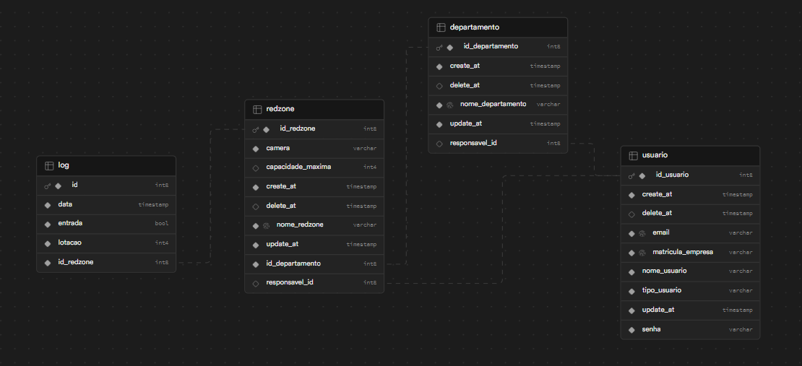
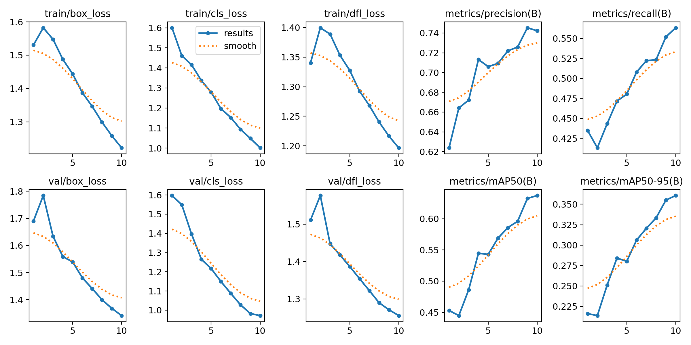

# 📃 DoR(Definition of Ready):

## 🗒️ Backlog Sprint 3
| Rank | Prioridade | User Story | Estimativa |Sprint | Requisito do Parceiro |
|--- |--- |--- |--- |--- |--- |
| 1 | Alta | Como gerente, quero que use uma inteligência artificial que utilize a câmera na entrada da redzones para fazer a contagem de pessoas que saíram e entraram dela, para não precisar fazer uma contagem manual.  | 80 | 1 | RF8 |
| 19 | Média | Como gerente geral, necessito de uma função de exportação de dados que me permita baixar relatórios de um departamento específico, com informações detalhadas sobre as datas e horários de entrada e saída na redzones durante o período selecionado para realizar análises externas mais detalhadas e precisa | 20 | 3 | RF4 |
| 20 | Média | Como Gerente Geral, quero um login que gerencie o acesso de usuários com diferentes níveis de permissão, incluindo guardas, gerentes de área e outros gerentes gerai, para que cada usuário tenha acesso apenas as partes do sistema relevantes para suas responsabilidades, mantendo assim a segurança e a integridade dos dados da empresa. | 20 | 3 | RF9 |
| 21 | Baixa |Como gerente, quero poder recuperar minha senha através de um processo seguro e confiável, para caso eu a esqueça no futuro. | 10 | 3 | RF9 |

Obs: User Story Rank 1 de volta para aplicação de melhorias apontadas do sprint review.

RF4 - Geração de relatórios para compartilhamento.

RF8 - Utilizar a câmera da entrada para contabilizar as pessoas que entraram e saíram da Redzone.

RF9 - Criar três níveis (Usuário de visualização, Gerente Por 
Departamento e Gerente geral) de acesso para o projeto.

## 📋  User Stories, Critérios de Aceitação e Tasks

### **US #1:** Como gerente, quero que use uma inteligência artificial que utilize a câmera na entrada da redzones para fazer a contagem de pessoas que saíram e entraram dela, para não precisar fazer uma contagem manual. 

### **Critérios de aceitação:**

**Cenário 1 – Fluxo Principal de Contagem de Pessoas**

<small>

**DADO QUE :** 
- O sistema de contagem automática de pessoas está configurado e funcionando corretamente 
- A câmera na entrada da redzone está conectada e operacional 

**QUANDO :** 
- A inteligência artificial utilizar a câmera para detectar e contar as pessoas que entram e saem  

**ENTÃO :** 
- A contagem será registrada pelo sistema e atualizada em tempo real 

- O Gerente poderá monitorar a contagem de pessoas na redzone por meio de uma interface dedicada

</small>

**Cenário 2 – Condições de luz**

<small>

**DADO QUE :**  
- O sistema de contagem automática de pessoas está configurado e funcionando corretamente  
- A câmera na entrada da redzone está conectada e operacional  

**QUANDO :**  
- A luminosidade ambiente mudar, seja devido à luz natural durante o dia ou à iluminação artificial à noite 

**ENTÃO :**  
- O sistema deve ainda ser capas de detectar a circulação de pessoas mesmo com essa alteração  
- A contagem de pessoas na redzone continuará a ser registrada e atualizada em tempo real 

</small>

**Cenário 3 – Variação de Distâncias:**

<small>

**DADO QUE :**  
- O sistema de contagem automática de pessoas está configurado e funcionando corretamente 
- A câmera na entrada da redzone está conectada e operacional 
- E as pessoas podem estar em distâncias variadas da câmera ao entrarem na redzone, incluindo diferentes locais de instalação da câmera 

**QUANDO :**  
- Uma pessoa se aproximar da câmera e entrar na redzone, independentemente da proximidade ou distância em relação à câmera 

**ENTÃO :** 
- O sistema deverá ser capaz de detectar e contar com precisão todas as pessoas quem entraem na redzone 
- A contagem total de pessoas na redzone será precisa e atualizada conforme necessário, considerando as diferentes posições de instalação da câmera. 

</small>

### **Tasks :**
<small>

- Treinar e implementar otimizações na IA para tornar mais eficiente e leve.
- Encontrar o equilíbrio entre qualidade da imagem e desempenho da IA.
- Definir os melhores critérios para determinar se a pessoa vai ser contabilizada.
- Criar vídeos com a câmera em distancias diferentes para testar a IA e registar o desempenho nessas variações.
- Criar vídeos com Iluminação diferentes para testar a IA e registar as variações.

</small>

### **US #19:** Como gerente geral, necessito de uma função de exportação de dados que me permita baixar relatórios de um departamento específico, com informações detalhadas sobre as datas e horários de entrada e saída na redzones durante o período selecionado para realizar análises externas mais detalhadas e precisa 

### **Critérios de aceitação:**

**Cenário 1 – Acesso ao Departamento e Geração de Relatório**

<small>

**DADO QUE :**  
- Há pelo menos uma redzone e um departamento cadastrados no sistema  
- O usuário deseja gerar um relatório para um departamento específico  

**QUANDO :**  
- O usuário acessa o departamento desejado  
- Seleciona o período desejado para o relatório  

**ENTÃO :**   
- O sistema retorna os logs de todas as redzones associadas àquele departamento e disponibiliza métodos de exportação   
- O usuário escolhe o método de exportação preferido
- O sistema realiza o download do relatório

</small>

**Cenário 2 – Sem Departamentos Cadastrados**

<small>

**DADO QUE :**  
- Não há departamentos cadastrados no sistema 

**QUANDO :**   
- O usuário tenta acessar um departamento para gerar um relatório  

**ENTÃO :**    
- O sistema exibe uma mensagem informando que não existem departamentos no sistema

</small>

**Cenário 3 – Sem Registros de Logs**

<small>

**DADO QUE :**  
- Há pelo menos uma redzone e um departamento cadastrados no sistema  

**QUANDO :**   
- O usuário deseja gerar um relatório para um departamento específico  
- Seleciona o período desejado para o relatório   
- E não há registros de logs no período selecionado  

**ENTÃO :**  
- O sistema mostra uma mensagem indicando que não há registros disponíveis  

</small>

### **Tasks :**
<small>

- Desenvolver a lógica necessária para poder estruturar os logs do departamento a serem exportados.
- Adicionar no front a opção para gerar relatório do relatório do departamento.
- Retirar do rodapé do site informações com Fecebook, LinkedIn e Instagram da empresa Altave.
- Adicionar Loading na página de registro do departamento

</small>

#### **US #20:** Como Gerente Geral, quero um login que gerencie o acesso de usuários com diferentes níveis de permissão, incluindo guardas, gerentes de área e outros gerentes gerai, para que cada usuário tenha acesso apenas as partes do sistema relevantes para suas responsabilidades, mantendo assim a segurança e a integridade dos dados da empresa.

#### **Critérios de aceitação:**

**Cenário 1 – Login com Credenciais Corretas**

<small>

**DADO QUE :**  
- O sistema está disponível, operacional e o usuário esteja cadastrado no sistema  

**QUANDO :**   
- O usuário acessa a página de login do sistema  
- Insere as credenciais corretas (e-mail e senha)  

**ENTÃO :**  
- o sistema verifica as credenciais  
- Autêntica o usuário com sucesso  

</small>

**Cenário 2 – Login com Credenciais Incorretas**

<small>

**DADO QUE :** 
- O sistema está disponível e operacional  

**QUANDO :** 
- O usuário acessa a página de login do sistema  
- Insere um e-mail ou senha incorreto  

**ENTÃO :** 
- O sistema verifica as credenciais  
- Exibe uma mensagem de erro indicando que a senha e o email não são correspondentes está incorreto  
- E Solicita que o usuário tente novamente  

</small>

### Tasks:

<small>

- Desenvolver o sistema de login no backend com base os materiais do professor Mineda 
- Fazer os níveis de permissão para que cada usuário tenha acesso apenas as partes do sistema relevantes para suas responsabilidades.
- Implementar no frontend o sistema de login que foi desenvolvido no backend
- Resolver o problema relacionado a reloader que estão ocorrendo no Frontend do Render 
- Mapear os tipos de usuário para termos mais compreensíveis para os usuários finais
- Criar a tela de perfil dos usuários para o usuário pode visualizar os seus dados é alterá-los caso necessário 
- Criar tela para o gerente de área poder visualizar todas as redzones cadastradas no do departamento que ele é responsável 

</small>

#### **US #21:** Como gerente, quero poder recuperar minha senha através de um processo seguro e confiável, para caso eu a esqueça no futuro. 

### **Critérios de aceitação:**

**Cenário 1 – Recuperação de Senha com Sucesso**

<small>

**DADO QUE :** 
- O sistema está operacional 
- O usuário possui uma conta registrada no sistema 

**QUANDO :** 
- O usuário acessa a página de recuperação de senha do sistema 
- Insere o e-mail associado à sua conta 
- Solicita o envio do e-mail de recuperação 
- Recebe o e-mail com o código de validação 
- Insere o código de validação no campo correspondente 
- E o código inserido está correto 

**ENTÃO :** 
- O sistema valida o código 
- Redireciona o usuário para a tela de alteração de senha 
- O usuário insere a nova senha duas vezes para confirmação 
- O sistema salva a nova senha criptografada 

</small>

**Cenário 2 – E-Mail Não Cadastrado**

<small>

**DADO QUE :** 
- O sistema está operacional 

**QUANDO :** 
- O usuário acessa a página de recuperação de senha do sistema 
- Insere o e-mail que não foi cadastrado  

**ENTÃO :** 
- O sistema devolve uma mensagem indicando que não há esse e-mail cadastrado no sistema  

</small>

**Cenário 3 – Código de Validação Incorreto**

<small>

**DADO QUE :** 
- O sistema está operacional 
- O usuário possui uma conta registrada no sistema 

**QUANDO :** 
- O usuário acessa a página de recuperação de senha do sistema 
- Insere o e-mail associado à sua conta 
- Solicita o envio do e-mail de recuperação 
- Recebe o e-mail com o código de validação 
- Insere um código de validação incorreto no campo correspondente 

**ENTÃO :** 
- O sistema exibe uma mensagem de erro indicando que o código está incorreto 
- O usuário pode tentar novamente 

</small>

**Cenário 4 – Tempo de Expiração do Código**

<small>

**DADO QUE :** 
- O sistema está operacional 
- O usuário possui uma conta registrada no sistema 

**QUANDO :** 
- O usuário acessa a página de recuperação de senha do sistema 
- Insere o e-mail associado à sua conta 
- Solicita o envio do e-mail de recuperação 
- E-mail com o código de validação é enviado 
- O usuário não insere o código dentro do tempo de expiração 

**ENTÃO :** 
- O sistema redireciona o usuário para a tela de login 

</small>

### Tasks:

<small>

- Desenvolver um processo no backend seguro e confiável para que os usuários possam recuperar suas senhas caso as esqueçam.
- Implementar a interface no frontend para a recuperação de senha. 

</small>

## 📝  Modelo do Banco de Dados

## 🎨 Mockups

O layout da aplicação está disponível no Figma:

## 💾 Dados
Nessa sprint, focamos em melhorar o desempenho e a fluidez do nosso sistema de inteligência artificial. Para alcançar esse objetivo, decidimos treinar um novo modelo de dados que pudesse aprimorar a precisão da contagem.

Utilizamos o dataset fornecido pelo [RoboFlow](https://universe.roboflow.com/leo-ueno/people-detection-o4rdr/dataset/8), que nos permitiu treinar nosso modelo com uma diversidade de exemplos e situações. O treinamento foi realizado utilizando a biblioteca [YOLOv8](https://github.com/autogyro/yolo-V8), uma das ferramentas mais eficazes para detecção de objetos em tempo real.

Os resultados iniciais foram bastante promissores, com uma precisão de apuração variando entre 74%. Este nível de precisão está bem acima do mínimo necessário para contabilizar corretamente a circulação, que é de 50%.

Para otimizar o desempenho do sistema, implementamos uma estratégia onde a leitura dos dados é feita a cada três frames, contabilizando apenas um. Essa abordagem reduz a carga de processamento sem comprometer significativamente a precisão da contagem,

Além disso, incluímos uma validação no sistema para evitar contagens negativas, garantindo que a contagem seja sempre precisa e confiável. Essa validação é crucial para manter a integridade dos dados e fornecer informações úteis para análise posterior.

Resultados em Gráfico: 

