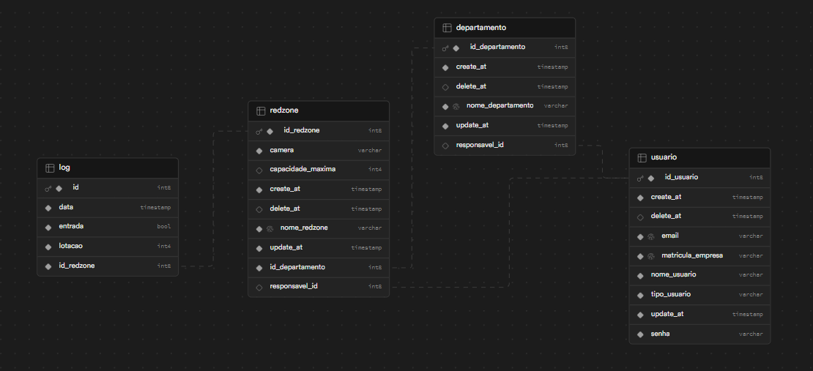
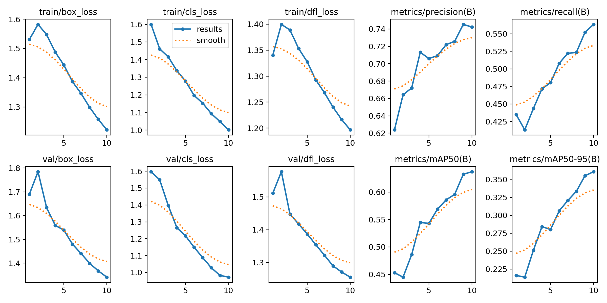

# 📃 DoR(Definition of Ready):

## 🗒️ Backlog Sprint 4
| Rank | Prioridade | User Story | Estimativa |Sprint | Requisito do Parceiro |
|--- |--- |--- |--- |--- |--- |
| 1 | Alta | Como gerente, quero que use uma inteligência artificial que utilize a câmera na entrada da redzones para fazer a contagem de pessoas que saíram e entraram dela, para não precisar fazer uma contagem manual.  | 80 | 1 | RF8 |
| 22 | Alta | Como gerente, quero um manual do usuário detalhado e fácil de entender, que forneça orientações passo a passo sobre como utilizar todas as funcionalidades do sistema, para que eu possa utilizar o sistema de forma eficaz e sem problemas. | 40 | 4 | RNF1 | 
| 23 | Média | Como gerente geral, quero um dashboard que compile e exiba métricas importantes de todos os departamentos, incluindo capacidade atual, número de alertas ativos e média de permanência das pessoas, para facilitar a análise e tomada de decisões estratégicas em relação à segurança e gestão de recursos. | 20 | 4 | RF2 |
| 24 | Média |Como gerente área, quero um dashboard que compile e exiba métricas importantes de todos as redzones que são do meu departamento, incluindo capacidade atual, número de alertas ativos e média de permanência das pessoas, para facilitar a análise e tomada de decisões estratégicas. | 20 | 4 | RF2 |
| 25 | Baixa | Como gerente geral, quero um guia de instalação detalhado e claro, para facilitar a implantação do sistema. | 20 | 4 | RNF3 |

Obs: User Story Rank 1 de volta para aplicação de melhorias apontadas do sprint review.

RF2 - Desenvolver um Dashboard de indicadores por períodos.

RF8 - Utilizar a câmera da entrada para contabilizar as pessoas que entraram e saíram da Redzone. 

RNF1 - Manual do Usuário.

RNF3 - Guia de instalação; Front - Back - IA.

## 📋  User Stories, Critérios de Aceitação e Tasks

### **US #1:** Como gerente, quero que use uma inteligência artificial que utilize a câmera na entrada da redzones para fazer a contagem de pessoas que saíram e entraram dela, para não precisar fazer uma contagem manual. 

### **Critérios de aceitação:**

### **Cenário 1 – Fluxo Principal de Contagem de Pessoas** 

<small>
  
**DADO QUE :** 
- O sistema de contagem automática de pessoas está configurado e funcionando corretamente 
- A câmera na entrada da redzone está conectada e operacional 

**QUANDO :** 
- A inteligência artificial utilizar a câmera para detectar e contar as pessoas que entram e saem  

**ENTÃO :** 
- A contagem será registrada pelo sistema e atualizada em tempo real 
- O Gerente poderá monitorar a contagem de pessoas na redzone por meio de uma interface dedicada

</small>

### **Cenário 2 – Contagem Simultânea de Entradas e Saídas**

<small>

**DADO QUE :** 
- O sistema de contagem automática de pessoas está configurado e funcionando corretamente 
- A câmera na entrada da redzone está conectada e operacional 

**QUANDO :** 
- A inteligência artificial detectar múltiplas pessoas entrando e saindo simultaneamente pela entrada da redzone 

**ENTÃO :** 
- sistema será capaz de registrar a entrada e saída de cada pessoa de forma precisa e em tempo real 
- O Gerente poderá visualizar um relatório atualizado do número total de entradas e saídas pela interface dedicada 

</small>

### **Cenário 3 – Situação de Quase Entrada na Redzone**

<small>

**DADO QUE :** 
- O sistema de contagem automática de pessoas está configurado e funcionando corretamente 
- A câmera na entrada da redzone está conectada e operacional 

**QUANDO :** 
- Uma pessoa passar perto da entrada da redzone sem realmente entrar nela 

**ENTÃO :** 
- O sistema não registrará essa pessoa como uma entrada na redzone 
- O contador de entradas permanecerá inalterado, garantindo a precisão da contagem 

</small>

### Tasks:

<small>

- Criar vídeos para testar contagem simultânea de entradas e saídas na redzone (Caso necessário buscar formas de resolver essa situação)
- Criar vídeos para testar a situação de quase entrada na redzones. (Caso necessário buscar formas de resolver essa situação)
- Medir acurácia média por cenário apresentado e fazer um gráfico com elas para facilitar a visualização.

</small>

### **US #22:** Como gerente, quero um manual do usuário detalhado e fácil de entender, que forneça orientações passo a passo sobre como utilizar todas as funcionalidades do sistema, para que eu possa utilizar o sistema de forma eficaz e sem problemas.

### **Critérios de aceitação:**

### **Cenário – Disponibilidade, Clareza e Conteúdo do Manual do Usuário** 

<small>

**DADO QUE :** 
- Um manual do usuário foi criado e está disponível para os usuários do GitHub

**QUANDO :** 
- Quando o usuário procurar pelo manual.

**ENTÃO :** 
- O manual será disponibilizado em formato PDF contendo: 
  - Capa
  - Objetivo do manual com uma visão do projeto
  - Níveis de acesso do sistema
  - Hierarquia das redzones
  - Funcionalidades principais do sistema
  - Explicação das dashboards
- As instruções serão claras e fáceis de entender, sem falar muito técnicas.
- O manual incluirá capturas de tela e exemplos práticos para ilustrar os passos

</small>

### Tasks:

<small>

- Desenvolva um manual do usuário completo em pdf que seja fácil de entender.

</small>

### **US #23:Como gerente geral, quero um dashboard que compile e exiba métricas importantes de todos os departamentos, incluindo capacidade atual, número de alertas ativos e média de permanência das pessoas, para facilitar a análise e tomada de decisões estratégicas em relação à segurança e gestão de recursos.** 

### **Critérios de aceitação:**

### **Cenário 1 – Fluxo Principal: Exibição e Interatividade do Dashboard de Métricas** 

<small>

**DADO QUE :** 
- O sistema possui redzones cadastradas e associadas ao departamento
- Existem dados registrados nas redzones para as métricas a serem exibidas no dashboard

**QUANDO :** 
- O usuário acessa o sistema e navega até a página do dashboard de métricas

**ENTÃO :** 
- O sistema exibe as métricas gerais, incluindo:
  - Capacidade atual de todas as redzones do departamento
  - Número total de alertas ativos em todas as redzones do departamento
  - Média de permanência das pessoas em todas as redzones do departamento
- O usuário poderá interagir com os dados, incluindo:
  - Ampliar ou reduzir o período de análise
  - Filtrar métricas específicas
  - Visualizar detalhes adicionais
- O dashboard será atualizado automaticamente conforme os dados são recebidos do sistema

</small>

### **Cenário 2 – Ausência de Departamentos Cadastrados** 

<small>

**DADO QUE :** 
- O sistema não possui nenhum departamento cadastrado

**QUANDO :** 
- O usuário acessa o sistema e navega até a página do dashboard de métricas

**ENTÃO :** 
- O sistema exibe uma mensagem informando que não existem departamentos no sistema

</small>

### **Cenário 3 – Ausência de Redzones Cadastradas** 

<small>

**DADO QUE :** 
- Sistema possui departamentos cadastrados, mas não possui nenhuma redzone cadastrada

**QUANDO :** 
- O usuário acessa o sistema e navega até a página do dashboard de métricas

**ENTÃO :** 
- O sistema exibe uma mensagem informando que não existem redzones no sistema

</small>

### **Cenário 4 – Ausência de Dados no Período Selecionado** 

<small>

**DADO QUE :** 
- O sistema possui departamentos e redzones cadastrados, mas não há registros de logs no período selecionado

**QUANDO :** 
- O usuário acessa o sistema e navega até a página do dashboard de métricas

**ENTÃO :** 
- O sistema mostra uma mensagem indicando que não há registros disponíveis no período selecionado

</small>

### Tasks:

<small>

- Desenvolver a lógica necessária no backend para devolver as métricas (Citadas na user story) na dashboard do departamento
- Produzir a dashboard do departamento no frontend com gráficos atrativos de sua preferência, mas assegurando que todas as métricas sejam utilizadas de maneira significativa. (As métricas estão citadas na user story)
- Criar página de not found

</small>

### **US #24:Como gerente área, quero um dashboard que compile e exiba métricas importantes de todos as redzones que são do meu departamento, incluindo capacidade atual, número de alertas ativos e média de permanência das pessoas, para facilitar a análise e tomada de decisões estratégicas.** 

### **Critérios de aceitação:**

### **Cenário 1 – Fluxo Principal: Exibição e Interatividade do Dashboard de Métricas** 

<small>

**DADO QUE :** 
- Existem dados registrados nas redzones para as métricas a serem exibidas no dashboard

**QUANDO :** 
- Usuário acessa o sistema e navega até o dashboard de sua redzone 

**ENTÃO :** 
- O sistema exibe as métricas gerais das redzones incluindo:
  - Capacidade atual de cada redzone
  - Número total de alertas ativos em todas as redzone
  - Média de permanência das pessoas dessa redzone 
- O usuário pode interagir com os dados, como:
   Ampliar ou reduzir o período de análise
  - Filtrar métricas específicas
  - Visualizar detalhes adicionais por redzone
- O dashboard será atualizado automaticamente conforme os dados são recebidos do sistema

</small>

### **Cenário 2 – Ausência de Dados no Período Selecionado** 

<small>

**DADO QUE :** 
- Sistema esteja funcional, mas não há registros de logs no período selecionado

**QUANDO :** 
- Usuário acessa o sistema e navega até o dashboard de métricas de sua redzone 

**ENTÃO :** 
- O sistema mostra uma mensagem indicando que não há registros disponíveis no período selecionado

</small>

### Tasks:

<small>

- Desenvolver no backend a lógica necessária para poder disponibilizar as métricas das redzones para a criação da dashboard. (Métricas citadas na user story)
- Criar no frontend a dashboard da redzone com base nos dados nas métricas disponibilizado na user story. (Assim como o de departamento possui a liberdade para escolher os gráficos utilizados de sua preferência)
- Inserir tooltip nos títulos dos cards do dashboard

</small>

### **US #25:Como gerente geral, quero um guia de instalação detalhado e claro, para facilitar a implantação do sistema.** 

### **Critérios de aceitação:**

### **Cenário – Guia de Instalação para Frontend, Backend e IA** 

<small>

**DADO QUE :** 
- Tanto o Frontend, quanto o Backend e a IA possuem no seu respectivo Readme.md 
- O guia de instalação inclui pré-requisitos e instruções desde a instalação até a execução do sistema
- As instruções são simples e explicam cada comando de forma clara
- Os usuários podem copiar os comandos diretamente do guia para facilitar a execução

**QUANDO :** 
- O gerente geral acessa os repositórios do Frontend, Backend e IA para consultar os guias de instalação

**ENTÃO :** 
- Os guias de instalação estarão bem visíveis e organizados nos Readme.md correspondentes
- Todos os pré-requisitos estarão claramente listados para utilização do sistema
- O passo a passo completo permitirá a instalação e execução do sistema sem dificuldades adicionais
- Os comandos serão apresentados de maneira que os usuários possam copiá-los facilmente

</small>

### Tasks:

<small>

- Desenvolva um guia de instalação completo com comandos necessários para a execução e expor os mesmos no readme.

</small>

## 📝  Modelo do Banco de Dados

## 🎨 Mockups

O layout da aplicação está disponível no Figma:

## 💾 Dados
Nessa sprint, focamos em melhorar o desempenho e a fluidez do nosso sistema de inteligência artificial. Para alcançar esse objetivo, decidimos treinar um novo modelo de dados que pudesse aprimorar a precisão da contagem.

Utilizamos o dataset fornecido pelo [RoboFlow](https://universe.roboflow.com/leo-ueno/people-detection-o4rdr/dataset/8), que nos permitiu treinar nosso modelo com uma diversidade de exemplos e situações. O treinamento foi realizado utilizando a biblioteca [YOLOv8](https://github.com/autogyro/yolo-V8), uma das ferramentas mais eficazes para detecção de objetos em tempo real.

Os resultados iniciais foram bastante promissores, com uma precisão de apuração variando entre 74%. Este nível de precisão está bem acima do mínimo necessário para contabilizar corretamente a circulação, que é de 50%.

Para otimizar o desempenho do sistema, implementamos uma estratégia onde a leitura dos dados é feita a cada três frames, contabilizando apenas um. Essa abordagem reduz a carga de processamento sem comprometer significativamente a precisão da contagem,

Além disso, incluímos uma validação no sistema para evitar contagens negativas, garantindo que a contagem seja sempre precisa e confiável. Essa validação é crucial para manter a integridade dos dados e fornecer informações úteis para análise posterior.

## Video da Sprint 4

***Por favor, para o carregamento das gifs espere alguns segundos.***
Sistema de Login e Niveis de Usuarios
!niveis de usuario

# IA e Melhoramentos Resultados:

- Cenário 1 – Fluxo Principal de Contagem de Pessoas

)

- Cenário 2 – Contagem Simultânea de Entradas e Saídas

)

- Cenário 3 – Situação de Quase Entrada na Redzone

)

 - Resultados em Gráfico: 

- As métricas do treinamento realizado: 

- Cenários com diferentes distâncias requisito pela Sprint Review: 

)

- Media de Acurácia dos cenários desta Quarta Sprint:

)

